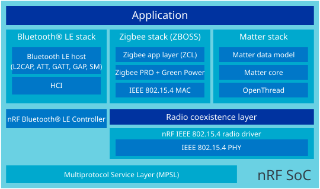

.. _matter_zigbee_architectures:

Platform design
###############

.. contents::
   :local:
   :depth: 2

.. _matter_zigbee_platform_design:

Single-chip, combined Matter + Zigbee (SoC)
===========================================

In this design, the Zigbee (ZBOSS) and Matter over Thread (OpenThread) stacks run on the same nRF SoC and share the single 802.15.4 radio through a coexistence layer, while a `SoftDevice Controller`_ instance handles Bluetooth LE (CHIPoBLE) commissioning.
Radio ownership is time-separated and persists across reboots.
The device boots on the configured default protocol (Zigbee by default).
While Zigbee is active, Matter advertises for commissioning over Bluetooth LE in parallel.
The 802.15.4 radio is handed over to OpenThread once Matter commissioning completes or you request a protocol switch.

.. list-table::
   :header-rows: 1
   :widths: 20 40 40

   * - Aspect
     - Advantage
     - Trade-off
   * - Deployment model
     - A single firmware image can start as Zigbee and migrate to Matter after commissioning or a button-triggered switch, without reflashing.
     - Switching back to Zigbee is supported by a long button press. Removing the last Matter fabric or triggering a Matter factory reset clears Matter commissioning data and resets the persisted protocol to the configured default.
   * - Radio usage
     - Bluetooth LE commissioning (CHIPoBLE) runs concurrently with Zigbee operation, so no separate commissioning device is needed.
     - The 802.15.4 radio is used by one stack at a time. Zigbee operation pauses once the device switches to Matter.
   * - Footprint
     - After Matter commissioning, the Zigbee stack is skipped on subsequent boots, removing it from the hot path.
     - The combined build has a larger memory footprint than either stack alone, and the partition layout is tuned for the supported target.
   * - Implementation
     - Reuses standard ZBOSS, OpenThread, and SoftDevice Controller components.
     - Requires additional orchestration through the :file:`matter_zigbee_coexistence` library and :file:`nrf_802154_callbacks_dispatcher`, which is not needed in Zigbee-only or Matter-only builds.

   Combined Matter + Zigbee architecture on a single SoC

This platform design is currently provided as a proof of concept and is supported on the following development kits:

* nRF54L15 DK (``nrf54l15dk/nrf54l15/cpuapp``)
* nRF54LM20 DK (``nrf54lm20dk/nrf54lm20a/cpuapp`` and ``nrf54lm20dk/nrf54lm20b/cpuapp``)
